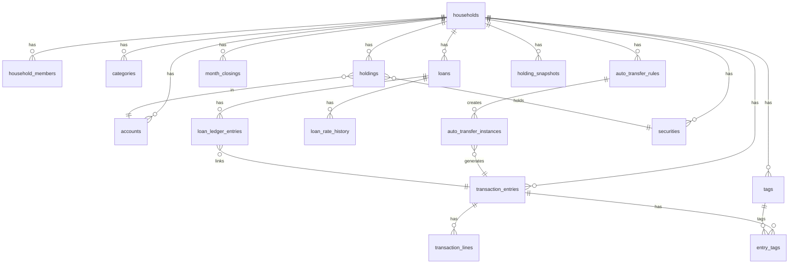

# DB Schema & Security (Supabase/Postgres) v1.1
작성일: 2026-02-25

목표:
- **가구 단위(=household_id) 데이터 격리**
- **복식부기(전표/라인)로 일관된 집계**
- **월 마감(락) + 조정 전표**로 불변성 확보
- Phase2(대출/투자) 확장에도 구조가 깨지지 않게 설계

---

## 0) 보안/권한 모델 요약
- 인증: Supabase Auth (auth.users)
- 권한: household_members(role=owner/member)
- 접근 제어: 모든 테이블에 household_id 포함 + RLS 강제
- 민감 작업(배치/푸시/서버 권한): Cloudflare Worker(서비스키는 Worker secret)

---

## 1) ERD(개념)

---

## 2) 공통/보안 테이블

### 2.1 profiles
- user_id uuid PK (FK auth.users)
- display_name text
- created_at timestamptz

### 2.2 households
- id uuid PK
- name text
- created_at timestamptz

### 2.3 household_members
- household_id uuid FK
- user_id uuid FK
- role text CHECK (role IN ('owner','member'))
- PRIMARY KEY(household_id, user_id)

### 2.4 audit_logs (권장)
- id bigserial PK
- household_id uuid
- user_id uuid
- action text
- payload_json jsonb
- created_at timestamptz

---

## 3) 마스터

### 3.1 account_groups
- id bigserial PK
- household_id uuid
- name text
- sort_order int
- is_active bool default true

### 3.2 accounts
- id bigserial PK
- household_id uuid
- group_id bigint nullable FK account_groups
- name text
- account_type text CHECK (account_type IN ('bank','brokerage','virtual','external'))
- currency text default 'KRW'
- opening_balance numeric(18,2) default 0
- is_active bool default true
- created_at, updated_at timestamptz

### 3.3 categories (L1/L2)
- id bigserial PK
- household_id uuid
- parent_id bigint nullable FK categories
- name text
- sort_order int
- is_active bool default true

### 3.4 tags
- id bigserial PK
- household_id uuid
- name text
- is_active bool default true
- UNIQUE(household_id, name)

---

## 4) 거래(복식부기)

### 4.1 transaction_entries
- id bigserial PK
- household_id uuid
- occurred_at timestamptz NOT NULL
- entry_type text CHECK (entry_type IN ('income','expense','transfer','adjustment'))
- category_id bigint nullable FK categories
- memo text
- source text CHECK (source IN ('manual','import','auto_transfer','loan','system'))
- is_locked bool default false
- created_by uuid FK auth.users
- created_at timestamptz default now()

### 4.2 transaction_lines
- id bigserial PK
- entry_id bigint FK transaction_entries
- account_id bigint FK accounts
- amount numeric(18,2) NOT NULL  -- inflow +, outflow -
- line_memo text nullable

### 4.3 entry_tags
- entry_id bigint FK transaction_entries
- tag_id bigint FK tags
- PRIMARY KEY(entry_id, tag_id)

#### 무결성(권장)
- entry 당 lines >= 2
- SUM(lines.amount)=0
- is_locked=true인 entry는 UPDATE/DELETE 금지(조정 전표만)

#### 인덱스(권장)
- transaction_entries(household_id, occurred_at desc)
- transaction_entries(household_id, category_id, occurred_at desc)
- transaction_lines(account_id)
- entry_tags(tag_id)

---

## 5) 자동이체

### 5.1 auto_transfer_rules
- id bigserial PK
- household_id uuid
- name text
- from_account_id bigint FK accounts
- to_account_id bigint nullable FK accounts
- category_id bigint FK categories
- amount_expected numeric(18,2)
- schedule_type text CHECK (schedule_type IN ('monthly','weekly','oneoff'))
- day_of_month int nullable
- tolerance_days int default 2
- tolerance_amount numeric(18,2) default 0
- start_date date
- end_date date nullable
- is_active bool default true
- created_at, updated_at timestamptz

### 5.2 auto_transfer_instances
- id bigserial PK
- household_id uuid
- rule_id bigint FK auto_transfer_rules
- due_date date
- expected_amount numeric(18,2)
- status text CHECK (status IN ('pending','confirmed','missed','skipped'))
- confirmed_at timestamptz nullable
- confirmed_by uuid nullable
- generated_entry_id bigint nullable FK transaction_entries
- note text

---

## 6) 예산/목표

### 6.1 budget_templates
- id bigserial PK
- household_id uuid
- name text
- is_default bool default false

### 6.2 budget_template_lines
- id bigserial PK
- template_id bigint FK budget_templates
- category_id bigint FK categories
- monthly_amount numeric(18,2)

### 6.3 budget_month_overrides
- id bigserial PK
- household_id uuid
- year_month char(7)  -- YYYY-MM
- category_id bigint FK categories
- amount numeric(18,2)
- UNIQUE(household_id, year_month, category_id)

### 6.4 allocation_targets (선택)
- id bigserial PK
- household_id uuid
- scope text default 'monthly'
- target_json jsonb

---

## 7) Import/룰/알림

### 7.1 import_profiles
- id bigserial PK
- household_id uuid
- name text
- mapping_json jsonb

### 7.2 classification_rules
- id bigserial PK
- household_id uuid
- pattern text
- category_id bigint nullable FK categories
- tag_ids jsonb
- priority int default 100
- is_active bool default true

### 7.3 notifications
- id bigserial PK
- household_id uuid
- user_id uuid
- type text
- payload_json jsonb
- created_at timestamptz
- read_at timestamptz nullable

### 7.4 push_subscriptions
- id bigserial PK
- user_id uuid
- endpoint text
- p256dh text
- auth text
- user_agent text
- created_at timestamptz

---

## 8) 월 마감/락

### 8.1 month_closings
- id bigserial PK
- household_id uuid
- year_month char(7)
- closed_at timestamptz
- closed_by uuid
- summary_json jsonb
- UNIQUE(household_id, year_month)

### 8.2 adjustment_links (선택)
- original_entry_id bigint
- adjustment_entry_id bigint
- created_at timestamptz

---

## 9) Phase2 — 대출

### 9.1 loans
- id bigserial PK
- household_id uuid
- name text
- principal_original numeric(18,2)
- start_date date
- maturity_date date nullable
- term_months int nullable
- repayment_type text CHECK (repayment_type IN ('interest_only','annuity','equal_principal','custom_schedule'))
- interest_pay_day int
- day_count_convention text default 'ACT365'
- rounding_rule text default 'round' CHECK (rounding_rule IN ('round','floor','ceil'))
- linked_payment_account_id bigint FK accounts
- is_active bool default true
- created_at timestamptz

### 9.2 loan_rate_history
- id bigserial PK
- loan_id bigint FK loans
- effective_date date
- annual_rate numeric(8,6)
- UNIQUE(loan_id, effective_date)

### 9.3 loan_ledger_entries (월 전표, locked)
- id bigserial PK
- loan_id bigint FK loans
- period_start date
- period_end date
- posting_date date
- interest_amount numeric(18,2)
- principal_amount numeric(18,2)
- fee_amount numeric(18,2) default 0
- balance_after numeric(18,2)
- locked bool default true
- generated_entry_id bigint nullable FK transaction_entries
- created_at timestamptz

### 9.4 loan_events
- id bigserial PK
- loan_id bigint FK loans
- event_date date
- event_type text CHECK (event_type IN ('prepayment','rate_change','manual_adjust'))
- amount numeric(18,2) nullable
- fee_amount numeric(18,2) nullable
- note text

### 9.5 loan_custom_schedule
- id bigserial PK
- loan_id bigint FK loans
- posting_date date
- expected_payment numeric(18,2)
- expected_interest numeric(18,2) nullable
- expected_principal numeric(18,2) nullable

---

## 10) Phase2 — 투자

### 10.1 securities
- id bigserial PK
- household_id uuid
- ticker text
- name text
- currency text default 'KRW'
- market text nullable
- UNIQUE(household_id, ticker)

### 10.2 holdings
- id bigserial PK
- household_id uuid
- security_id bigint FK securities
- account_id bigint FK accounts
- quantity numeric(18,6)
- avg_price numeric(18,6)
- last_price numeric(18,6) nullable
- last_price_updated_at timestamptz nullable
- created_at, updated_at timestamptz

### 10.3 holding_snapshots
- id bigserial PK
- household_id uuid
- snapshot_date date
- security_id bigint
- account_id bigint
- quantity numeric(18,6)
- avg_price numeric(18,6)
- last_price numeric(18,6)
- estimated_value numeric(18,2)
- UNIQUE(household_id, snapshot_date, security_id, account_id)

---

## 11) RLS 정책(원칙 + 템플릿)
### 11.1 원칙
- 모든 테이블 RLS ON
- 기본 DENY
- household_members에 존재하는 user만 접근

### 11.2 권장 함수(개념)
- is_household_member(household_id) returns boolean
- is_household_owner(household_id) returns boolean

### 11.3 템플릿(개념)
- SELECT: is_household_member(household_id)
- INSERT: is_household_member(household_id)
- UPDATE/DELETE:
  - is_household_member(household_id)
  - AND (is_locked=false)  -- transaction_entries에 한정
- Owner-only:
  - month_closings INSERT/UPDATE
  - loans/loan_rate_history/loan_events 관리

---

## 12) 배치/크론(Cloudflare Worker) 설계
- 월초: auto_transfer_instances 생성
- 매일: pending 자동이체 중 기한 경과/미확인 → notifications 생성 + push 발송
- 월말: closing 리마인드(선택)
- (Phase2) 납입일: loan_ledger_entries 기반 납입 거래 생성/연결(정책 선택)

---

## 13) 권장 View(집계)
- v_monthly_category_actual
- v_monthly_tag_actual
- v_account_balance_actual
- v_expected_outflows
- v_waterfall_monthly
