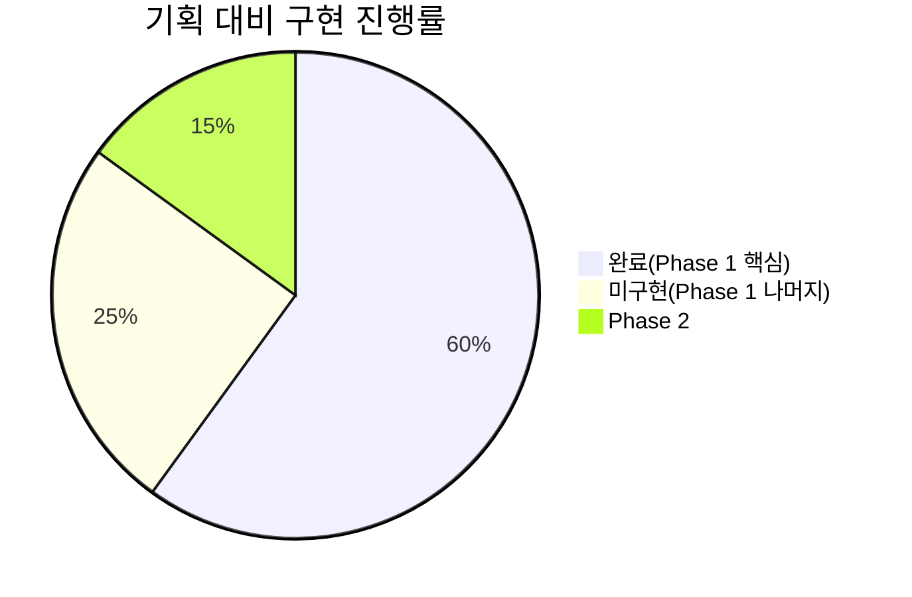
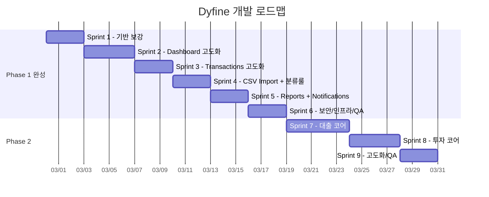

# Dyfine 종합 로드맵 v1.0

> 작성 참여: [PM] [DB Architect] [Frontend] [Backend] [Infra] [Designer] [Reviewer] [Scribe]
> 작성일: 2026-02-27 | 기준 문서: [01_PRD.md](file:///c:/Users/ddeok/Documents/dyfine/01_PRD.md), [02_Wireframe.md](file:///c:/Users/ddeok/Documents/dyfine/02_Wireframe.md), [03_DB_Schema.md](file:///c:/Users/ddeok/Documents/dyfine/03_DB_Schema.md)

---

## 현재 상태 (v0.7)

| 완료 ✅ | 미구현 ❌ |
|---|---|
| Phase 1 전체 (Dashboard, Transactions, Import, Reports, Notifications) | Phase 2 나머지 (투자 코어, 고도화/QA) |
| Sprint 7 대출 코어 (RLS, RPC, UI, 시뮬레이터) | |

---

## 로드맵 전체 흐름

---

## Sprint 1 — 기반 보강 (DB + 공통 컴포넌트)

> **목표**: Phase 2까지 확장 가능한 기반 구조 확보

| 에이전트 | 작업 | PRD/Schema 근거 |
|---|---|---|
| **[DB Architect]** | `account_groups` 테이블 생성 + 기존 accounts에 group_id FK 연결 | Schema 3.1 |
| **[DB Architect]** | `notifications` 테이블 생성 | Schema 7.3 |
| **[DB Architect]** | `audit_logs` 테이블 생성 | Schema 2.4 |
| **[DB Architect]** | 권장 View 생성 (`v_account_balance_actual`, `v_monthly_category_actual`) | Schema 13 |
| **[Backend]** | `is_locked=true`인 전표 UPDATE/DELETE 방지 RLS 정책 | Schema 11.3 + PRD F5 AC |
| **[Frontend]** | 공통 `<FilterBar>` 컴포넌트 (기간/계좌/카테고리/태그/키워드) | Wireframe 3.3, 3.6 |
| **[Frontend]** | 공통 `<MonthPicker>` 컴포넌트 (현재 곳곳에 중복) | Wireframe 3.2, 3.5 |
| **[Designer]** | 색상 팔레트 정리 — 수입(blue)/지출(red)/이체(gray)/경고(amber) 통일 | 전체 |

> [!IMPORTANT]
> **[Reviewer]**: `account_groups`은 Phase 2 투자 계좌 분류(brokerage)의 기반. 반드시 이 시점에 추가할 것. 또한 `is_locked` RLS는 현재 누락된 **치명적 결함** — 마감 후에도 전표 수정이 가능한 상태.

---

## Sprint 2 — Dashboard 고도화

> **목표**: Wireframe 3.2의 Sankey/Balance/Waterfall 차트 구현

| 에이전트 | 작업 | PRD/Wireframe 근거 |
|---|---|---|
| **[Frontend]** | 기간 선택(이번달/지난달/커스텀) + Expected 오버레이 토글 | Wireframe 3.2 상단 |
| **[Frontend]** | KPI 카드 보강: 가용현금, 미확인 자동이체 건수/금액 | Wireframe 3.2 KPI |
| **[Frontend]** | Sankey 차트 (계좌 간 자금 흐름, 클릭→Transactions 필터) | PRD F7 + Wireframe 3.2 좌 |
| **[Frontend]** | Balance 차트 (Actual/Projected 탭, 계좌 멀티선택) | Wireframe 3.2 우 |
| **[Frontend]** | Waterfall 차트 (수입→카테고리 지출→순증감) | Wireframe 3.2 하 |
| **[Frontend]** | "해야 할 일" 위젯 (미확인 자동이체 + 마감 알림) | Wireframe 3.2 우하 |
| **[Backend]** | `useDashboardData` 훅 확장 — 기간 파라미터, Expected 데이터 | 기존 훅 확장 |
| **[Designer]** | Sankey/Waterfall 색상 매핑 정의 | PRD 원칙 4 |

> [!WARNING]
> **[Reviewer]**: Sankey에 `recharts` 라이브러리가 지원 부족. `@ant-design/plots` 또는 `d3-sankey` 직접 구현 검토 필요. Balance Chart는 `recharts`의 `LineChart`로 충분.

---

## Sprint 3 — Transactions 고도화

> **목표**: Wireframe 3.3의 탭/필터/즐겨찾기 완성

| 에이전트 | 작업 | 근거 |
|---|---|---|
| **[Frontend]** | 탭 UI: 전체 / 인박스(미분류) / 즐겨찾기 / Import | Wireframe 3.3 탭 |
| **[Frontend]** | 필터바 연결 (기간/계좌/카테고리/태그/키워드/source) | Wireframe 3.3 필터 |
| **[Frontend]** | 즐겨찾기 템플릿 저장/불러오기/최근 복제 | PRD F2 + U4 (10초 입력) |
| **[Backend]** | `useTransactions` 훅 → 필터/페이지네이션 파라미터 지원 | 무한 스크롤 준비 |
| **[DB Architect]** | `favorite_templates` 테이블 생성 (household_id 기반, 멀티 디바이스 지원) | PRD F2 |

> [!NOTE]
> **[PM]**: 즐겨찾기는 사용자 피드백에 따라 **DB 테이블(`favorite_templates`)로 바로 구현**. 멀티 디바이스 동기화 보장.

---

## Sprint 4 — CSV Import + 분류 룰 엔진

> **목표**: PRD F6 (CSV Import + 중복 탐지 + 룰 기반 자동 분류)

| 에이전트 | 작업 | 근거 |
|---|---|---|
| **[Frontend]** | CSV 파일 업로드 UI + 클라이언트 파싱 (Papa Parse) | PRD F6 |
| **[Frontend]** | 파싱 결과 미리보기 + 컬럼 매핑 UI | Wireframe 3.3 Import 탭 |
| **[Frontend]** | 중복 탐지 결과 표시 (날짜+금액+메모 해시) | PRD F6 AC |
| **[Backend]** | 분류 룰 엔진 (classification_rules 조회 → 패턴 매칭 → 카테고리/태그 부착) | Schema 7.2 |
| **[Frontend]** | Settings > 분류 룰 관리 UI (패턴/카테고리/우선순위 CRUD) | Wireframe 3.12 Rules |
| **[Backend]** | Import Profile 관리 (CSV 컬럼 매핑 저장/불러오기) | Schema 7.1 |

> [!IMPORTANT]
> **[Reviewer]**: 중복 탐지는 서버 측(RPC)에서 최종 확인할 것. 클라이언트만으로는 race condition 발생 가능. `UNIQUE` 인덱스 또는 RPC 내 `ON CONFLICT` 활용 권장.

---

## Sprint 5 — Reports + Notifications

> **목표**: Wireframe 3.6 Reports 화면 + 3.11 Notifications

| 에이전트 | 작업 | 근거 |
|---|---|---|
| **[Frontend]** | Reports 페이지: 카테고리/태그 Top, 검색/필터, CSV Export | Wireframe 3.6 |
| **[Backend]** | `useReportsData` 훅 (집계 쿼리 + 필터) | Schema 13 View 활용 |
| **[Frontend]** | Notifications 페이지: 읽음/미읽음, 리스트 | Wireframe 3.11 |
| **[Backend]** | `useNotifications` 훅 | Schema 7.3 |
| **[Backend]** | 알림 생성 로직 — 자동이체 미확인 시 notifications INSERT | PRD F3 AC |
| **[Frontend]** | GNB에 알림 뱃지 (미읽음 건수) | Wireframe 3.11 |
| **[Infra]** | Web Push 구독/발송 기반 (push_subscriptions) — 선택 | Schema 7.4 |

---

## Sprint 6 — 보안/인프라/QA (Phase 1 마무리)

> **목표**: PRD 9장(NFR/보안) 충족 + Phase 1 최종 검수

| 에이전트 | 작업 | 근거 |
|---|---|---|
| **[Infra]** | Cloudflare Pages 배포 + CI/CD (GitHub Actions) | PRD 9.3 |
| **[Infra]** | CSP 헤더, Rate Limit (로그인) | PRD 9.2 |
| **[Infra]** | Cloudflare Workers: 월초 자동이체 인스턴스 Cron | Schema 12 + PRD F3 |
| **[Backend]** | RLS 전수 점검 — 모든 테이블 DENY 기본 확인 | Schema 11 |
| **[Reviewer]** | 전체 기능 E2E 검증: 로그인→온보딩→거래→예산→마감 플로우 | PRD U1~U6 |
| **[Reviewer]** | 보안 검토: XSS, CSRF, RLS 우회 시도 | PRD 9.1~9.2 |
| **[Scribe]** | Changelog v1.0, API 명세서, 사용 가이드 작성 | — |

> [!CAUTION]
> **[Reviewer]**: Phase 1 릴리스 전 반드시 is_locked RLS, RPC SECURITY DEFINER 권한 범위, Supabase Anon Key 노출 범위를 최종 감사할 것.

---

## Sprint 7 — Phase 2: 대출 코어

> **목표**: PRD P2-L1 (대출 생성/금리 이력/월 전표/납입 연결)

| 에이전트 | 작업 | 근거 |
|---|---|---|
| **[DB Architect]** | Phase 2 마이그레이션 적용 확인 (loans ~ loan_custom_schedule, 이미 생성됨) | Schema 9 |
| **[Backend]** | `create_loan` RPC + `generate_loan_ledger` RPC (월 전표 생성) | PRD P2-L1 산출 |
| **[Backend]** | 금리 변경 시 이후 전표 재생성 로직 (과거 불변) | PRD 원칙 6 |
| **[Backend]** | 중도상환 이벤트 처리 RPC | PRD P2-L1 |
| **[Frontend]** | 대출 목록/상세 페이지 (Wireframe 3.9) | Wireframe 3.9 |
| **[Frontend]** | 금리 이력 편집 UI + 월 전표(locked) 리스트 | Wireframe 3.9 |
| **[Frontend]** | 추가상환 시뮬레이터 (클라이언트 계산) | PRD P2-L1 |

---

## Sprint 8 — Phase 2: 투자 코어

> **목표**: PRD P2-I1 (종목/보유/평가/배분/드리프트)

| 에이전트 | 작업 | 세부 내용 |
|---|---|---|
| **[DB Architect]** | RLS 정책 추가 | `securities`, `holdings`, `holding_snapshots`에 `household_id` 격리 정책 적용 |
| **[Backend]** | `record_trade` RPC | 매수/매도 시 `holdings` 수량/단가 갱신 & `transaction_entries` 생성 (원자적) |
| **[Backend]** | `update_holding_snapshot` RPC | 마감 시 또는 수동으로 보유 자산 스냅샷 생성 |
| **[Backend]** | `useInvestments` 훅 | `useHoldings`, `useSecurities`, `useTradeHistory` 추가 |
| **[Frontend]** | InvestmentsPage | 요약 카드(수익률), 보유 테이블, 매매 입력 모달 |
| **[Frontend]** | 자산 배분/추이 차트 | Recharts 기반 Pie/Area 차트 |

> [!TIP]
> **[Reviewer]**: 매매 거래 시 계좌 잔액(`accounts.balance`)과 보유 자산(`holdings.quantity`)이 동시에 변동되므로 반드시 **RPC 트랜잭션**으로 처리할 것. 매수 시에는 `transaction_entries`에 지출(또는 계좌이체 형식)로 기록됨.

---

## Sprint 9 — Phase 2 고도화/QA

> **목표**: Phase 2 통합 테스트 + 대시보드 Phase 2 반영

| 에이전트 | 작업 | 근거 |
|---|---|---|
| **[Frontend]** | Dashboard에 대출 납입일 마커, 투자 평가 KPI 추가 | Wireframe 3.2 |
| **[Frontend]** | 월 마감에 "대출 납입 연결 누락" 경고 추가 | Wireframe 3.8 |
| **[Backend]** | Cron: 납입일 기준 자동 전표 생성(대출) | Schema 12 |
| **[Reviewer]** | Phase 2 E2E 검증: U7~U10 스토리 전수 테스트 | PRD U7~U10 |
| **[Scribe]** | Changelog v2.0, Phase 2 문서 갱신 | — |

---

## [Reviewer] 최종 소견

> [!WARNING]
> **현 시점 치명적 이슈 1건**: `is_locked=true`인 전표에 대한 UPDATE/DELETE 방지 RLS가 **미적용** 상태. Sprint 1에서 반드시 해결할 것. 이것이 없으면 월 마감(F5)의 의미가 없음.

> [!NOTE]
> **Phase 2 호환성 확인**: DB 스키마는 이미 Phase 2 테이블(loans, securities 등)이 마이그레이션에 포함되어 있어 **스키마 수준에서는 Phase 2 준비 완료**. RPC와 UI만 추가하면 됨.

| 평가 항목 | 점수 | 비고 |
|---|---|---|
| DB Schema 정합성 | ★★★★☆ | account_groups 누락 외 양호 |
| Wireframe 정합성 | ★★★☆☆ | Dashboard 차트, Transactions 필터/탭 미구현 |
| Phase 2 확장 준비도 | ★★★★☆ | DB 테이블 OK, 코드 구조도 훅 기반으로 확장 용이 |
| 보안 | ★★☆☆☆ | is_locked RLS 미적용 — 치명적 |
| 코드 품질 | ★★★★☆ | React Query 전환 완료, 모듈화 양호 |

**[Verdict]**: 로드맵 승인 권고. 단, Sprint 1의 `is_locked` RLS 보완을 **최우선**으로 실행할 것.
