# Dyfine 사용자 매뉴얼

> **[Scribe] 작성 | [Reviewer] 검수**
> 버전: v3.0 | 최종 업데이트: 2026-03-05

Dyfine은 가구 단위의 재정을 통합 관리하는 웹 가계부입니다.
이 문서는 각 기능별 사용법을 안내합니다.

---

## 목차

1. [대시보드](#1-대시보드)
2. [거래 내역](#2-거래-내역)
3. [자동 이체](#3-자동-이체)
4. [예산 관리](#4-예산-관리)
5. [대출 관리](#5-대출-관리)
6. [투자 관리](#6-투자-관리)
7. [리포트](#7-리포트)
8. [누리무무 (반려견)](#8-누리무무-반려견-관리)
9. [용돈 관리](#9-용돈-관리)
10. [계좌 관리](#10-계좌-관리)
11. [카테고리 관리](#11-카테고리-관리)
12. [마이 프로필](#12-마이-프로필)

---

## 1. 대시보드

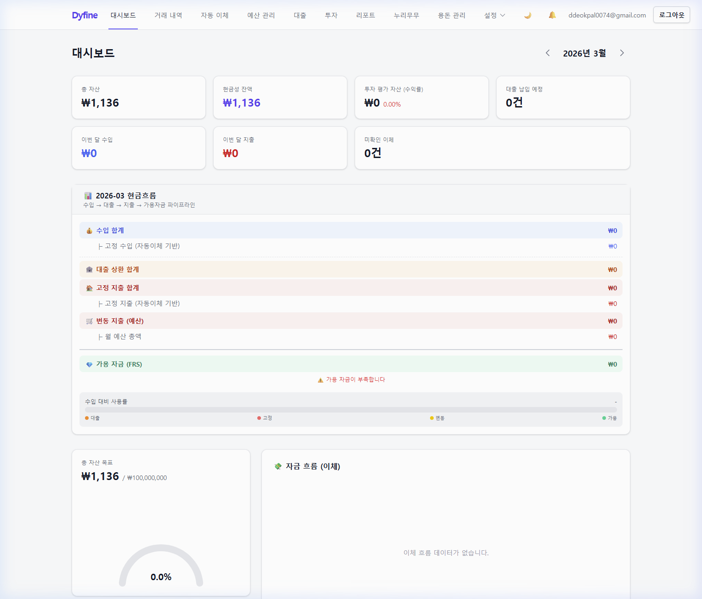

### 개요
로그인 후 가장 먼저 보이는 화면입니다. 가구의 재정 현황을 한눈에 파악할 수 있습니다.

### 주요 구성

| 영역 | 설명 |
|---|---|
| **자산 요약 카드** | 총 자산, 현금성 잔액, 투자 평가 자산을 실시간으로 표시 |
| **현금흐름** | 이번 달 수입(근로/비정기), 대출, 고정지출, 변동지출, 가용 자금 집계 |
| **자산 목표** | 총 자산 목표 대비 달성 현황을 시각화 |
| **자금 흐름** | 최근 자금 이동(이체) 내역을 타임라인으로 표시 |

### 사용 팁
- 자산 요약 카드를 클릭하면 해당 계좌로 이동합니다.
- 현금흐름은 거래 내역과 예산이 입력되면 자동으로 집계됩니다.

---

## 2. 거래 내역

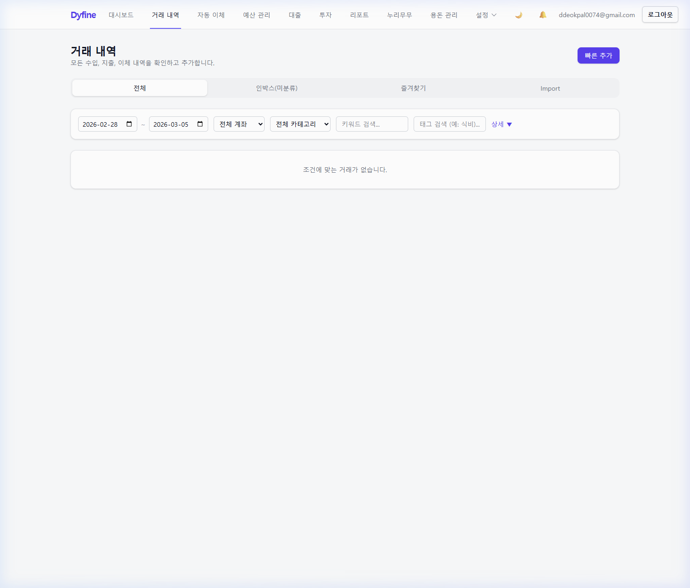

### 개요
모든 수입/지출 거래를 등록, 조회, 분류하는 핵심 기능입니다.

### 주요 기능

#### 거래 등록
1. 우측 상단 **빠른 추가** 버튼 클릭
2. 필수 항목 입력: 유형(수입/지출/이체), 금액, 날짜, 계좌, 카테고리
3. 선택 항목: 메모, 태그
4. **저장** 클릭

#### 탭 구분
| 탭 | 설명 |
|---|---|
| **전체 내역** | 모든 거래를 최신순으로 표시 |
| **인박스** | 미분류 거래 (CSV Import 후 분류 대기) |
| **즐겨찾기** | 즐겨찾기 표시한 거래 |
| **Import** | CSV 파일에서 가져온 거래 |

#### 필터링
- **기간**: 시작일~종료일 설정
- **계좌**: 특정 계좌만 조회
- **카테고리**: 특정 카테고리만 조회
- **키워드/태그**: 메모나 태그로 검색

#### 거래 입력자 표시
각 거래에 👤 아이콘과 함께 입력한 사용자 이름이 표시됩니다.

---

## 3. 자동 이체

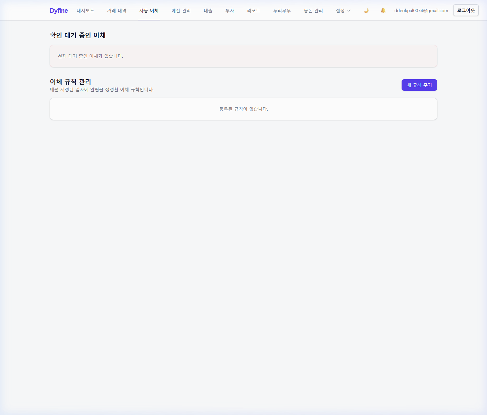

### 개요
정기적으로 발생하는 이체 규칙을 등록하고, 자동 감지된 이체를 확인합니다.

### 사용 방법

#### 이체 규칙 등록
1. **새 규칙 추가** 클릭
2. 이체 이름, 출금 계좌, 입금 계좌, 금액, 주기 설정
3. 저장하면 해당 주기마다 자동으로 이체 내역이 생성됩니다

#### 확인 대기
시스템이 감지한 이체 중 아직 확정되지 않은 건이 **확인 대기 중인 이체** 섹션에 표시됩니다.

---

## 4. 예산 관리

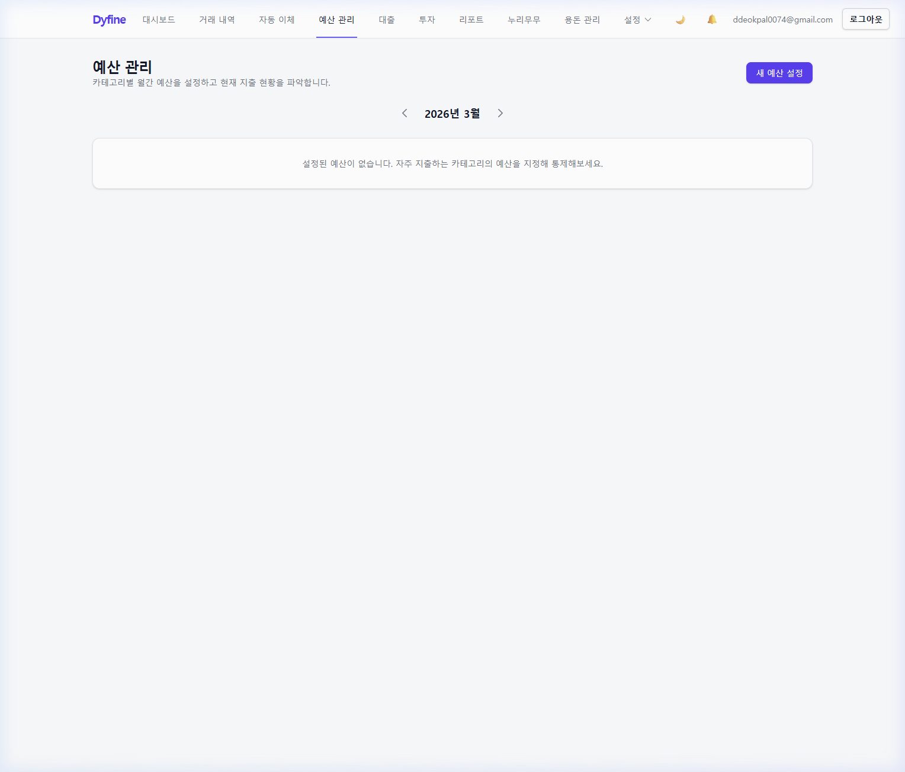

### 개요
카테고리별 월간 지출 한도를 설정하여 계획적인 소비를 돕습니다.

### 사용 방법

1. 상단 **년-월** 선택기로 예산을 설정할 달을 선택
2. **새 예산 설정** 클릭
3. 카테고리별 지출 한도를 입력
4. 저장 후 해당 월의 예산 대비 실제 지출을 비교할 수 있습니다

### 사용 팁
- 예산을 초과하면 붉은색으로 경고 표시됩니다
- 이전 달의 예산을 복사하여 다음 달에 적용할 수 있습니다

---

## 5. 대출 관리

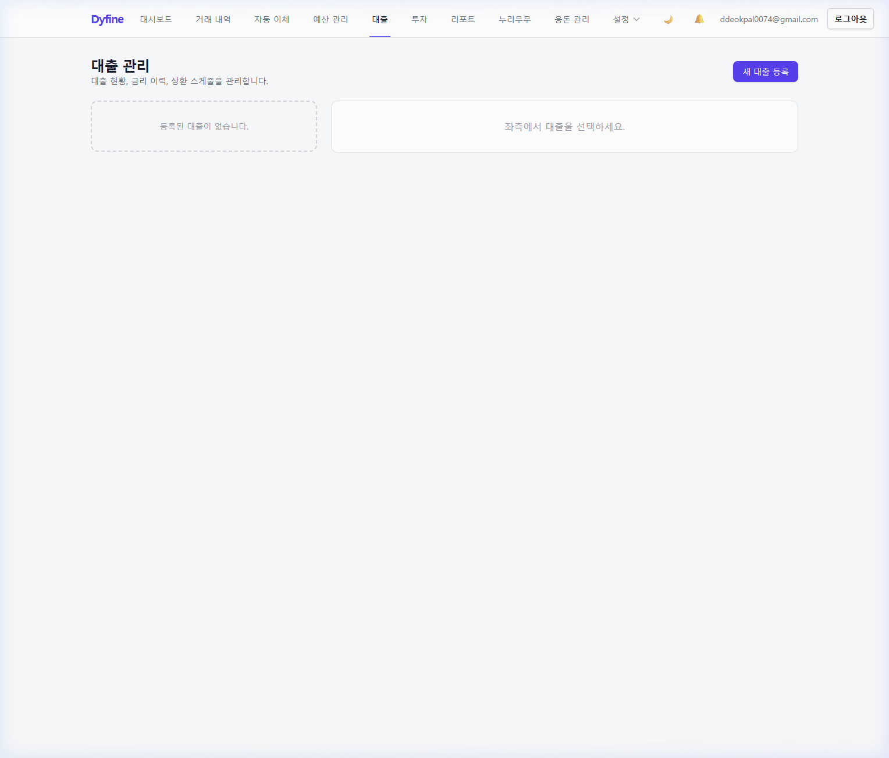

### 개요
가구의 모든 대출을 등록하고, 금리 이력·상환 스케줄을 체계적으로 관리합니다.

### 주요 기능

#### 대출 등록
1. **새 대출 등록** 클릭
2. 입력 항목:
   - 대출명, 은행명, 원금, 시작일, 만기일
   - 상환 방식(원리금균등/원금균등/만기일시)
   - 초기 금리, 이자납입일
   - 연결 계좌, 상환 우선순위
3. 저장 시 자동으로 초기 원장(Ledger) 생성

#### 금리 변경 기록
좌측 대출 목록에서 대출 선택 → **금리 변경** 입력으로 금리 이력 추적

#### 상환 스케줄
등록된 대출 정보를 기반으로 월별 상환 금액(원금+이자)을 자동 계산합니다.

---

## 6. 투자 관리

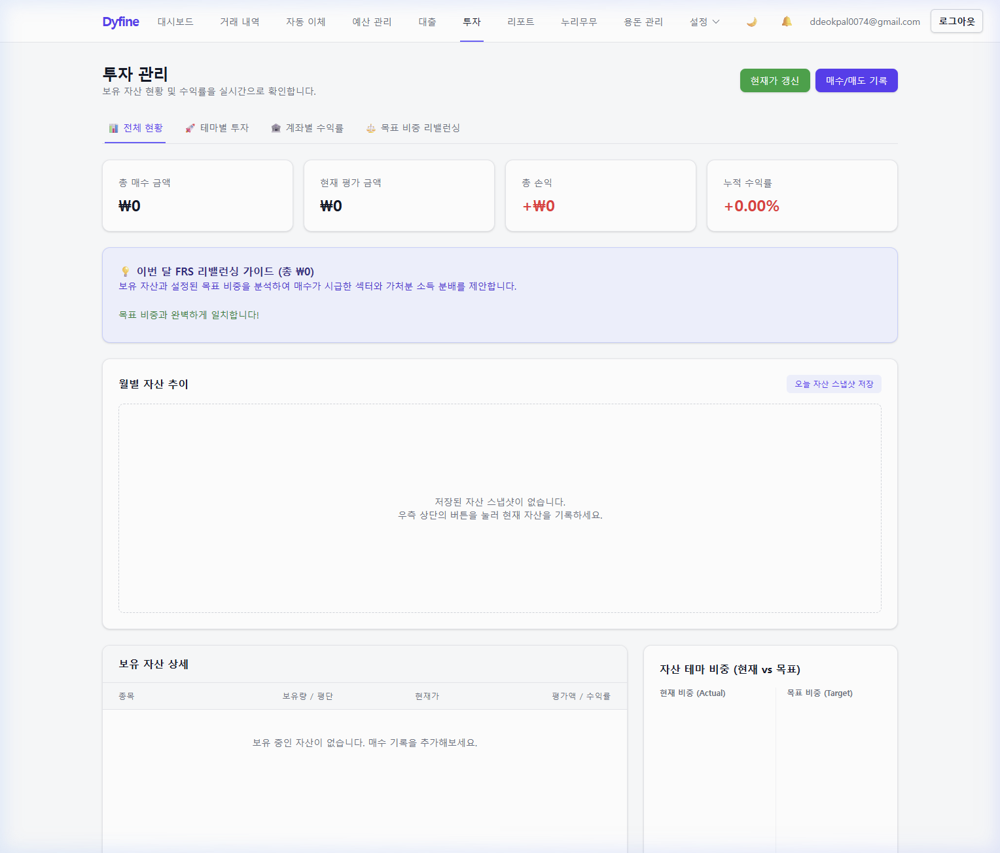

### 개요
주식, 펀드, ETF 등 투자 자산을 등록하고 포트폴리오를 관리합니다.

### 주요 기능
- **보유 종목** 등록 및 현재가 업데이트
- **투자 목표** 설정 (목표 자산, 기간)
- **월별 스냅샷** 기록으로 자산 변동 추이 추적
- **월간 투자 기여금** 기록

---

## 7. 리포트

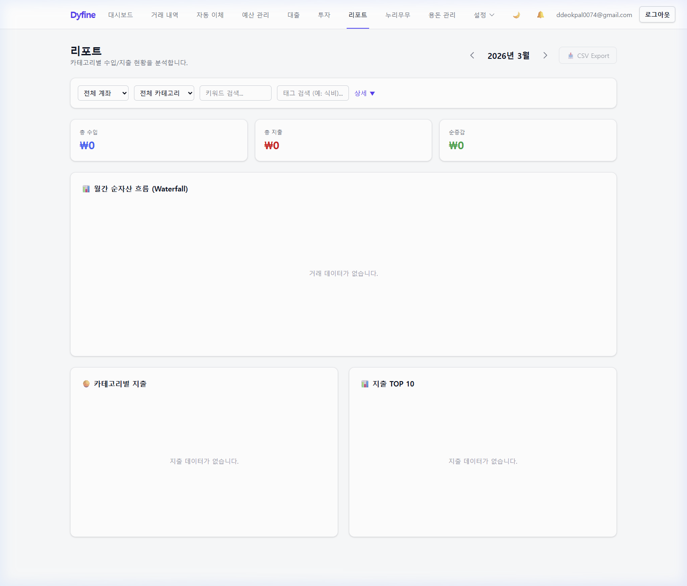

### 개요
재정 데이터를 기반으로 다양한 분석 보고서를 생성합니다.

### 리포트 유형
- 월별 수입/지출 비교
- 카테고리별 지출 비중
- 자산 변동 추이
- 예산 대비 실적

---

## 8. 누리무무 (반려견 관리)

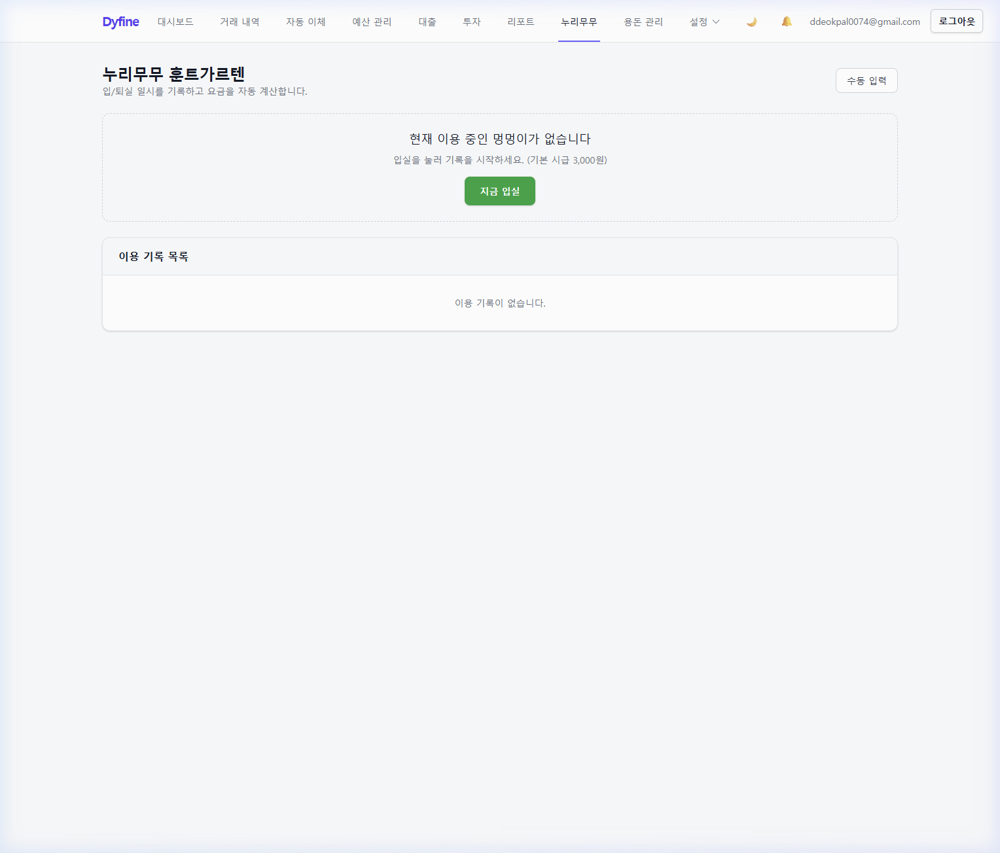

### 개요
반려견(오구)의 미용, 병원, 사료 등 케어 일정과 비용을 전문적으로 기록합니다.

### 사용 방법

1. **새 기록 추가** 클릭
2. 입력 항목:
   - 날짜, 서비스 유형 (미용/병원/사료/산책 등)
   - 업체명, 비용, 메모
3. 저장 후 날짜순으로 기록이 정렬됩니다

### 사용 팁
- 정기적인 미용이나 건강검진 주기를 파악하는 데 유용합니다
- 비용 항목은 거래 내역과 별도로 관리됩니다

---

## 9. 용돈 관리

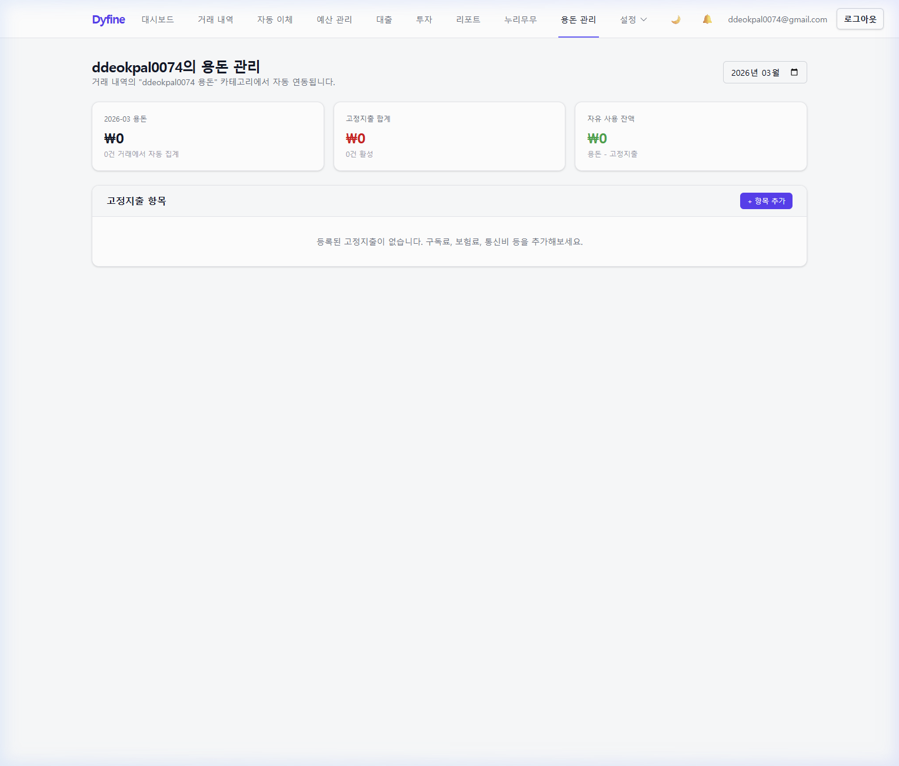

### 개요
가구 구성원 각자의 개인 용돈을 관리합니다. **본인 데이터만 조회 가능**합니다.

### 핵심 원리
> 거래 내역에서 "**{이름} 용돈**" 카테고리로 기록된 금액이 자동으로 반영됩니다.

### 화면 구성

| 영역 | 설명 |
|---|---|
| **이번 달 용돈** | 거래 내역에서 자동 집계된 용돈 합계 |
| **고정지출 합계** | 구독료, 보험료, 통신비 등 매월 고정 지출 |
| **자유 사용 잔액** | 용돈 – 고정지출 = 자유롭게 쓸 수 있는 금액 |

### 사용 방법

#### 용돈 반영 (자동)
1. **거래 내역** 페이지에서 "덕원 용돈" 또는 "여선 용돈" 카테고리로 거래 입력
2. 용돈 관리 페이지에 자동 반영

#### 고정지출 등록 (수동)
1. **+ 항목 추가** 클릭
2. 항목명(예: 유튜브 프리미엄), 금액, 카테고리(구독/보험/통신/교통/저축/기타) 입력
3. 저장 후 잔액이 자동 재계산

### 보안
- **본인만 접근 가능**: DB 레벨(RLS)에서 타인의 용돈 데이터 조회 차단
- 로그인 계정별로 자동 분리되어 별도 설정 불필요

---

## 10. 계좌 관리

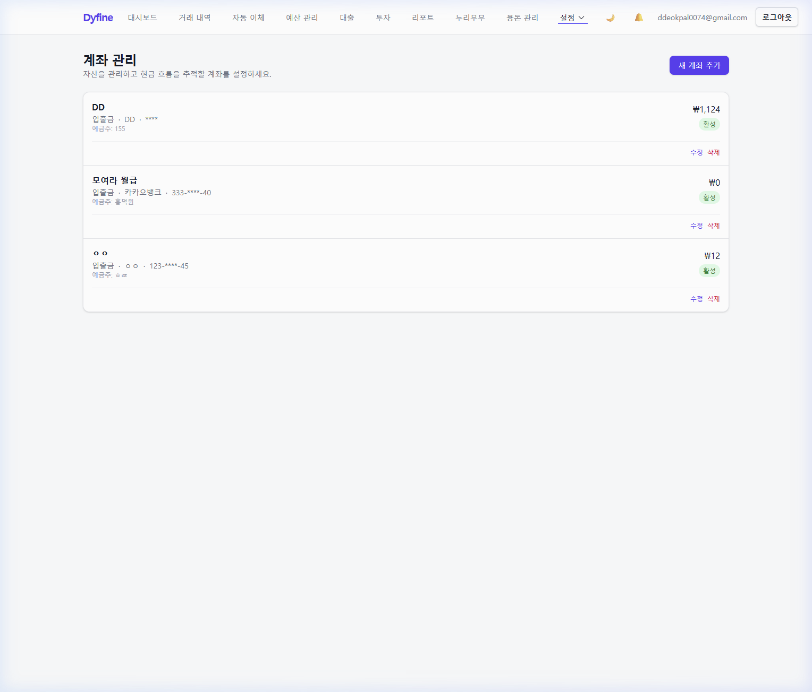

### 개요
가구의 모든 금융 계좌(은행, 카드, 투자)를 등록하고 관리합니다.

### 계좌 등록
1. **계좌 추가** 클릭
2. 입력 항목:
   - 계좌명, 은행명, 계좌번호 (자동 마스킹)
   - 예금주, 계좌 유형 (입출금/적금/신용카드/체크카드/투자)
   - 초기 잔액
3. 저장 후 목록에 즉시 반영

### 계좌 유형

| 유형 | 설명 |
|---|---|
| 입출금 | 일반 입출금 통장 |
| 적금 | 정기 적금 |
| 적립식 적금 | 자동 이체 적금 |
| 신용카드 | 신용카드 |
| 체크카드 | 체크카드 |
| 투자 | 주식/펀드 계좌 |

### 잔액
거래 내역이 입력되면 **초기 잔액 + 거래 합계** = 현재 잔액이 자동 계산됩니다.

---

## 11. 카테고리 관리

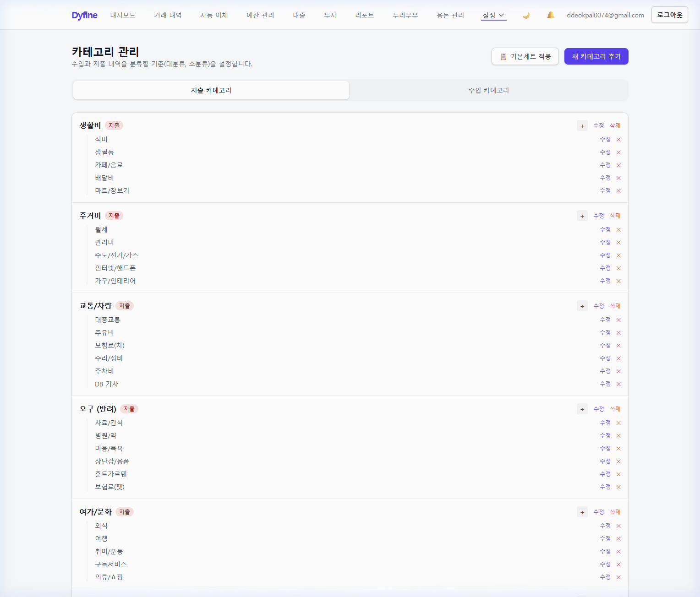

### 개요
수입과 지출을 분류할 카테고리(대분류 → 소분류)를 설정합니다.

### 탭 구분
- **지출 카테고리**: 생활비, 주거비, 교통 등 지출 분류
- **수입 카테고리**: 급여, 부수입, 이자/배당 등 수입 분류

### 사용 방법

#### 기본 세트 적용
처음 사용 시 **📋 기본세트 적용** 버튼을 클릭하면 한국 가계부 표준 카테고리가 자동 생성됩니다.

#### 카테고리 추가
1. **새 카테고리 추가** 클릭
2. 카테고리명, 유형(수입/지출/공통), 상위 카테고리(대분류) 선택
3. 저장

#### 하위 카테고리 추가
대분류 카드의 **+** 버튼을 클릭하면 해당 대분류 아래에 소분류를 바로 추가할 수 있습니다.

---

## 12. 마이 프로필

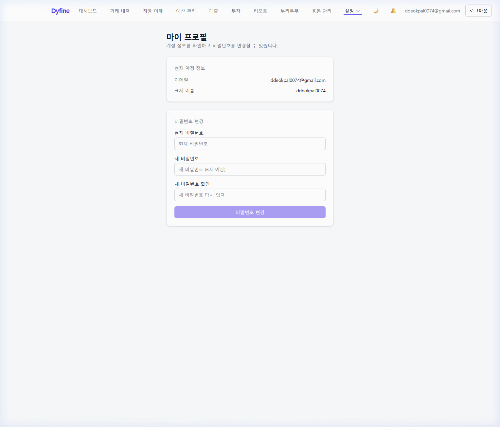

### 개요
계정 정보 확인, 표시 이름 변경, 그리고 비밀번호 변경을 관리합니다.

### 현재 계정 정보
- **이메일**: 로그인에 사용하는 이메일 주소
- **표시 이름**: 거래 입력자 표시, 용돈 관리 등에 사용되는 이름

### 비밀번호 변경
1. **현재 비밀번호** 입력
2. **새 비밀번호** 입력 (6자 이상)
3. **새 비밀번호 확인** 재입력
4. **비밀번호 변경** 클릭

> ⚠️ 비밀번호 변경 후 재로그인은 필요하지 않습니다.

---

## 부록: 네비게이션 구조

```
Dyfine
├── [메인 메뉴]
│   ├── 대시보드         /
│   ├── 거래 내역        /transactions
│   ├── 자동 이체        /transfers
│   ├── 예산 관리        /budgets
│   ├── 대출             /loans
│   ├── 투자             /investments
│   ├── 리포트           /reports
│   ├── 누리무무         /petcare
│   └── 용돈 관리        /allowance
│
├── [설정 메뉴]
│   ├── 마이 프로필      /profile
│   ├── 계좌 관리        /accounts
│   ├── 분류 관리        /categories
│   ├── 월 마감          /closing
│   ├── CSV Import       /import
│   └── 분류 룰          /rules
│
└── [알림]               /notifications
```

---

> 📝 이 매뉴얼은 [Scribe]가 작성하고 [Reviewer]가 검수하였습니다.
> 기능 추가/변경 시 본 문서를 함께 업데이트합니다.
