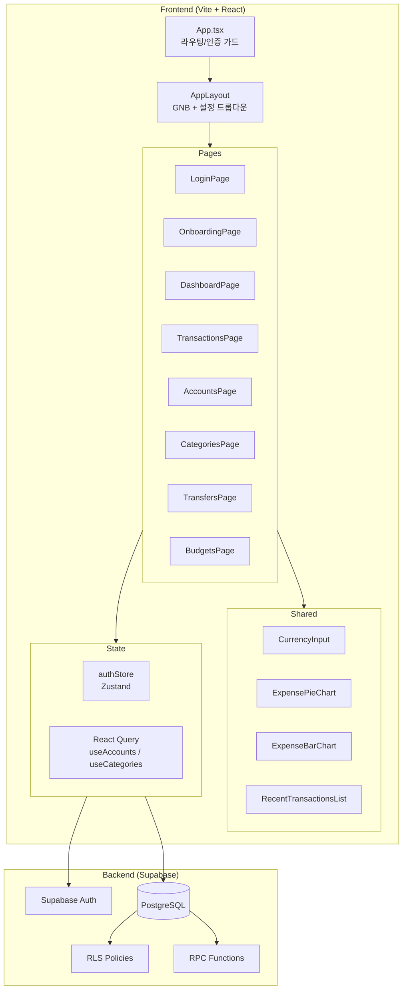
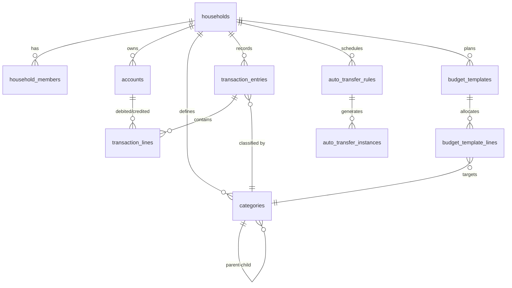

# Dyfine 전체 프로젝트 검토 보고서

> **[Reviewer] 시니어 코드 리뷰어 + [Scribe] 테크니컬 라이터 합동 보고**
> 작성일: 2026-02-27 | 버전: v1.5 (Phase 1 MVP + Phase 1.5 피드백 반영)

---

## 1. 프로젝트 개요

| 항목 | 내용 |
|------|------|
| 프로젝트명 | Dyfine — 가정용 자금 운영 서비스 |
| 목적 | 수동 통제 기반의 복식부기 가계부 (입력 최소화, 의사결정 최대화) |
| 기술 스택 | React 18 + TypeScript + Vite + Tailwind CSS v4 + Zustand + Supabase |
| 배포 타겟 | Cloudflare Pages (예정) |
| 인증 | Supabase Auth (Email/Password) |
| DB | Supabase PostgreSQL + RLS |
| 상태관리 | Zustand (authStore) + React Query (서버 상태) |

---

## 2. 시스템 구조도



---

## 3. 파일 트리 및 역할

```
src/
├── App.tsx                          # 라우팅, 인증 가드, 온보딩 플로우
├── main.tsx                         # 진입점 (AuthProvider + React Query)
├── index.css                        # Tailwind v4 임포트 + 글로벌 스타일
├── store/
│   └── authStore.ts                 # Zustand: user, session, householdId 관리
├── lib/
│   └── supabase/client.ts           # Supabase 클라이언트 인스턴스
├── hooks/queries/
│   ├── useAccounts.ts               # 계좌 목록 React Query 캐시 (30분)
│   └── useCategories.ts             # 카테고리 목록 React Query 캐시 (30분)
├── components/
│   ├── layout/AppLayout.tsx         # GNB + 설정 드롭다운 + 모바일 메뉴
│   ├── ui/CurrencyInput.tsx         # ₩ 콤마 자동 포맷팅 공통 컴포넌트
│   ├── dashboard/
│   │   ├── ExpensePieChart.tsx       # Recharts 파이 차트
│   │   ├── ExpenseBarChart.tsx       # Recharts 막대 차트
│   │   └── RecentTransactionsList.tsx # 최근 거래 5건 리스트
│   └── providers/AuthProvider.tsx   # 인증 상태 초기화 Provider
├── pages/
│   ├── auth/LoginPage.tsx           # 로그인/회원가입 (Email+PW)
│   ├── onboarding/OnboardingPage.tsx # 가구(Household) 생성 (RPC)
│   ├── dashboard/DashboardPage.tsx  # 총자산 · 수입 · 지출 + 차트 + 최근거래
│   ├── transactions/TransactionsPage.tsx # 복식부기 전표 CRUD + L1→L2 카테고리
│   ├── accounts/AccountsPage.tsx    # 계좌 관리 (6유형 + 은행/번호/예금주)
│   ├── settings/CategoriesPage.tsx  # 카테고리 L1/L2 + 지출/수입/공통 유형
│   ├── transfers/TransfersPage.tsx  # 자동이체 규칙 + 대기 인스턴스 확정
│   └── budgets/BudgetsPage.tsx      # 월별 예산 vs 실적 비교

supabase/migrations/
├── 0001_initial_schema.sql          # households, accounts, categories, tags, profiles
├── 0002_transaction_schema.sql      # entries, lines, auto_transfers, budgets, closings
├── 0003_phase2_loans_investments.sql # 대출/투자 (Phase 2 예약)
├── 0004_rpc_create_transaction.sql  # 복식부기 전표 생성 RPC
├── 0005_rls_policies.sql            # RLS 정책 정의
├── 0006_fix_rls_patch.sql           # RLS 재설정 + create_household_with_owner RPC
├── 0007_add_account_fields.sql      # 은행명, 계좌번호, 예금주 컬럼 추가
└── 0008_add_category_type.sql       # category_type 컬럼 추가
```

---

## 4. DB 스키마 (ERD 요약)



| 테이블 | 역할 | RLS |
|--------|------|-----|
| `households` | 가구 단위 격리 | ✅ |
| `household_members` | 가구 구성원 (owner/member) | ✅ |
| `accounts` | 계좌 (6유형 + 은행/번호/예금주) | ✅ |
| `categories` | 분류 (L1/L2 + income/expense/both) | ✅ |
| `transaction_entries` | 복식부기 전표 헤더 | ✅ |
| `transaction_lines` | 전표 차변/대변 라인 | ✅ |
| `auto_transfer_rules` | 자동이체 규칙 | ✅ |
| `auto_transfer_instances` | 이체 실행 인스턴스 | ✅ |
| `budget_templates` | 예산 템플릿 | - |
| `budget_template_lines` | 카테고리별 월 예산 배정 | - |
| `budget_month_overrides` | 월별 예산 오버라이드 | - |
| `month_closings` | 월 마감 기록 | ✅ |

---

## 5. 기능 현황표

| 기능 | 상태 | 비고 |
|------|------|------|
| 이메일 로그인/회원가입 | ✅ 완료 | Supabase Auth |
| 가구(Household) 생성 | ✅ 완료 | RPC `create_household_with_owner` |
| 계좌 CRUD | ✅ 완료 | 6유형 + 은행/계좌번호/예금주 |
| 카테고리 L1/L2 관리 | ✅ 완료 | 지출/수입/공통 유형 분리 |
| 복식부기 거래 입력 | ✅ 완료 | RPC 기반 트랜잭션 |
| L1→L2 캐스케이드 선택 | ✅ 완료 | Phase 1.5 |
| 대시보드 (요약/차트) | ✅ 완료 | 파이+막대 차트 (Recharts) |
| 자동이체 규칙/확정 | ✅ 완료 | 수동 확정 방식 |
| 예산 설정/비교 | ✅ 완료 | 월별 선택기 포함 |
| 금액 콤마 포맷팅 | ✅ 완료 | `CurrencyInput` 공통 컴포넌트 |
| 네비게이션 설정 메뉴 | ✅ 완료 | 드롭다운 구조 |
| 태그(Tag) 관리 | ⬜ 미구현 | DB 스키마만 존재 |
| CSV 가져오기 | ⬜ 미구현 | DB 스키마만 존재 |
| 월 마감(Lock) | ⬜ 미구현 | DB 스키마만 존재 |
| 대출 시스템 | ⬜ Phase 2 | 스키마 준비됨 |
| 투자 시스템 | ⬜ Phase 2 | 스키마 준비됨 |

---

## 6. [Reviewer] 전체 코드 리뷰

### 6-1. 🔴 Critical (즉시 수정 필요)

| # | 위치 | 문제 | 영향도 |
|---|------|------|--------|
| C-1 | `AccountsPage.tsx` | 기존 `bank` 타입 계좌의 라벨이 깨짐 (`getAccountTypeLabel`에서 `bank` → `default` 분기 처리) | **데이터 표시 오류** |
| C-2 | `BudgetsPage.tsx` | `useEffect` 의존성에 `householdId` 누락 — 로그인 직후 `householdId`가 늦게 세팅되면 데이터 미로드 | **기능 미동작** |
| C-3 | `DashboardPage.tsx` | 동일 이슈: `useEffect([user])` 의존성에 `householdId` 누락 | **기능 미동작** |
| C-4 | `TransfersPage.tsx` | 동일 이슈: `useEffect([user])` 의존성에 `householdId` 누락 | **기능 미동작** |
| C-5 | `AppLayout.tsx` | 설정 드롭다운 오버레이 `z-10`이 네비 전체를 차단, 다른 메뉴 클릭 불가 | **UX 차단** |
| C-6 | `TransfersPage.tsx :128-179` | `confirmInstance` 함수에서 Entry 생성 + Lines 생성이 **별도 쿼리로 분리**됨 → Entry만 생성되고 Lines 실패 시 고아 전표 발생 | **데이터 무결성** |

### 6-2. 🟡 Optimization (개선 권장)

| # | 위치 | 제안 |
|---|------|------|
| O-1 | `BudgetsPage.tsx` | `const now = new Date()` 매 렌더마다 재생성 → `useMemo` 또는 컴포넌트 외부 상수 |
| O-2 | `CategoriesPage.tsx` | 소분류 생성 시 `category_type`을 부모와 별도 선택 가능 → 대분류=지출인데 소분류=수입 모순 허용됨 |
| O-3 | `DashboardPage.tsx` | `any[]` 타입 3군데 사용 (`expenseByCategory`, `recentTransactions`) → 타입 안전성 없음 |
| O-4 | `TransfersPage.tsx` | 금액 입력이 아직 `type="number"` → `CurrencyInput` 미적용 (일관성 부족) |
| O-5 | 전체 페이지 | 에러 발생 시 `alert()` 사용 → UX가 거칠음, Toast 알림으로 교체 권장 |
| O-6 | `useAccounts.ts`, `useCategories.ts` | staleTime 30분이지만 데이터 변경 후 `invalidateQueries`를 일부 페이지에서 누락 |
| O-7 | `0001_initial_schema.sql` | `accounts.account_type` CHECK 제약이 원본과 `0007` 패치에서 이중 정의 → 마이그레이션 순서 주의 |
| O-8 | `CurrencyInput.tsx` | `value=0`일 때 빈 문자열로 표시 → 사용자가 초기잔액 0을 의도하는 경우 혼동 가능 |

### 6-3. 💡 Architecture Notes

| 항목 | 현재 상태 | 개선 방향 |
|------|-----------|----------|
| API 호출 패턴 | 페이지마다 직접 `supabase.from()` 호출 | 커스텀 훅으로 분리 (useTransactions, useBudgets 등) |
| 에러 핸들링 | `alert()` + `console.error` | 글로벌 에러 바운더리 + Toast UI |
| 타입 안전성 | `any` 타입 다수, 인터페이스 페이지 내 선언 | 공통 `types/` 디렉토리로 분리 |
| 복식부기 무결성 | RPC로 Entry+Lines 원자적 처리 (거래 OK) | 자동이체 확정은 RPC 미사용 → 원자성 미보장 |
| 모달 패턴 | 각 페이지에 인라인 모달 코드 반복 | `Modal` 공통 컴포넌트 추출 |
| 차트 라이브러리 | Recharts (ResponsiveContainer) | 적절한 선택, 유지 |

---

## 7. 마이그레이션 이력

| 파일 | 목적 | 실행 여부 |
|------|------|----------|
| `0001_initial_schema.sql` | 기초 테이블 + RLS 활성화 | ✅ 실행됨 |
| `0002_transaction_schema.sql` | 거래/예산/자동이체/마감 테이블 | ✅ 실행됨 |
| `0003_phase2_loans_investments.sql` | 대출/투자 테이블 (Phase 2) | ✅ 실행됨 |
| `0004_rpc_create_transaction.sql` | 복식부기 전표 생성 RPC | ✅ 실행됨 |
| `0005_rls_policies.sql` | RLS 정책 정의 | ✅ 실행됨 |
| `0006_fix_rls_patch.sql` | RLS 재설정 + 가구 생성 RPC | ✅ 실행됨 |
| `0007_add_account_fields.sql` | 계좌 필드 확장 | ⚠️ **실행 필요** |
| `0008_add_category_type.sql` | 카테고리 유형 컬럼 | ⚠️ **실행 필요** |

---

## 8. 버전 변경 이력 (Changelog)

### v1.5 — Phase 1.5 사용자 피드백 반영 (2026-02-27)
- **E-08**: 네비게이션 재구성 (설정 드롭다운 메뉴)
- **E-01/E-04**: 계좌 필드 확장 (은행명, 계좌번호, 예금주) + 6종 유형
- **E-05**: 거래 입력 시 L1→L2 캐스케이드 카테고리 선택
- **E-09**: 카테고리 지출/수입/공통 유형 분리
- **E-10**: `CurrencyInput` 공통 컴포넌트 (₩ 콤마 자동 포맷팅)
- **E-14**: 예산 페이지 월별 선택기 (화살표 네비게이션)

### v1.0 — Phase 1 MVP (2026-02-25~27)
- 사용자 인증 (로그인/회원가입)
- 가구 온보딩 (SECURITY DEFINER RPC)
- 계좌/카테고리 CRUD
- 복식부기 거래 입력 (RPC 트랜잭션)
- 대시보드 (요약 지표 + 차트)
- 자동이체 규칙/확정
- 예산 설정/비교
- RLS 정책 전면 재설정

---

## 9. [Reviewer] 최종 판정

### Overall Score: **B+ (양호 — 조건부 승인)**

| 영역 | 점수 | 코멘트 |
|------|------|--------|
| 안정성 | ⭐⭐⭐ | `useEffect` 의존성 누락, 자동이체 원자성 미보장 |
| 효율성 | ⭐⭐⭐⭐ | React Query 캐싱 적용, 불필요한 리렌더 일부 존재 |
| 유지보수 | ⭐⭐⭐ | 타입 분산, 모달 코드 반복, `any` 남용 |
| 기획 정합성 | ⭐⭐⭐⭐⭐ | PRD 대비 핵심 MVP 완성도 높음 |
| 디자인 | ⭐⭐⭐⭐ | 미니멀+기능적, 반응형 지원 |

> **[Verdict]**: Critical 6건 수정 후 **Phase 2 진입 승인** 가능.
> 특히 C-2/C-3/C-4 (`householdId` 의존성 누락)는 **로그인 직후 빈 화면** 원인이 될 수 있으므로 최우선 수정 대상.

---

## 10. 다음 단계 권장 로드맵

| 우선순위 | 작업 | 담당 |
|----------|------|------|
| 🔴 즉시 | Critical 6건 버그 수정 | Frontend, Backend |
| 🟡 단기 | `types/` 공통 타입 분리 + Toast 알림 도입 | Frontend |
| 🟡 단기 | 자동이체 확정을 RPC로 원자화 | Backend, DB |
| 🔵 중기 | Phase 2: 대출 시스템 (스키마 0003 기반) | All |
| 🔵 중기 | Phase 2: 투자 시스템 | All |
| ⬜ 장기 | CSV 가져오기, 태그 관리, 월 마감 | All |
